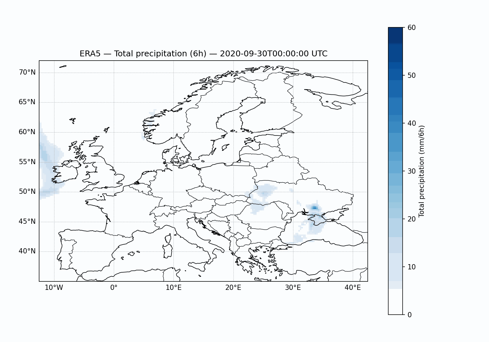

<h2 align="center">
  Explainability in a chaotic system – Application to weather forecasting
</h2>

<p align="center">
  
</p>


## 💡 Overview

This repository contains all the code developed as part of a CentraleSupélec project conducted in partnership with HeadMind Partners, focusing on the explainability of weather forecasting models. Specifically, we study precipitation prediction over Europe within a 6-hour forecasting horizon. Although some experiments were carried out with longer time horizons, their predictive performance was significantly lower; as a result, we chose not to include their explainability analyses in this repository. All models were trained using the ERA5 dataset from WeatherBench2.

The project is structured into two main phases:

1. **Precipitation prediction.**
We provide scripts to download and preprocess the data, train two types of models (U-Net and ConvLSTM), and evaluate their performance. More detailed information about the files and workflows is provided in a later section.

2. **Prediction explainability.**
We implement permutation-based methods and integrated gradients, combined with various aggregation strategies, to extract insights into the most influential input variables and time steps. These methods allow us to analyze which pixels contribute most to individual predictions, identify globally important features, explore patterns that are consistent with meteorological knowledge, and more. More detailed information about the explainability pipeline and related files is provided in a later section.


## 📦 Getting Started

To get a local copy of this project up and running, follow these steps.

1. **Clone the repository:**

   ```bash
   git clone git@github.com:manonarfib/X_Chaos_Meteo.git
   cd X_Chaos_Meteo
   ```

2. **Install dependencies:**

  We recommend using a virtual environment to manage dependencies.

   ```bash
   pip install -r requirements.txt
   ```

3. **Downloading UNet checkpoint**

If you can, you should install the Git LFS extension (see [https://git-lfs.com/](https://git-lfs.com/)), which handles the versioning of large files. In that case, you only need to run ```git lfs install``` (you only need to run that once in your git ), and the checkpoint is automatically usable from ```checkpoints/unet```.
However, if you can't install the extension (beware, it isn't installed on the DCE), you can clone the repository as usual, then go to [https://github.com/manonarfib/X_Chaos_Meteo/tree/main/checkpoints/unet](https://github.com/manonarfib/X_Chaos_Meteo/tree/main/checkpoints/unet), and manually download the checkpoint. Then you have to **rename** the file (we recommend to rename it ```best_mse_true.pt```), and drag and drop it in ```checkpoints/unet```.

## 📖 Usage

### 🗂️ Repository Structure Description

This repository is organized as follows:

```text
X_Chaos_Meteo/
├── demonstrator/
│   ├── 
│   ├── 
│   └── 
│
├── download_dataset_from_gcs/  # Scripts to download the data from WeatherBench2
│
├── era5_visuals/
│   ├── figures/            # Created visuals
│   └── visuels_era5.ipynb  # Notebook to create pretty representations of ERA5 variables
│
├── models/
│   ├── ConvLSTM/           # ConvLSTM architecture and training scripts
│   ├── unet/               # U-Net architecture and training scripts
│   └── utils/              # Preprocessing, postprocessing and evaluation scripts
│
├── explainability/
│   ├── integrated_gradients/  # Integrated Gradients implementation and aggregation methods
│   ├── permutation/           # Permutation-based importance methods
│   └── visualization/         # Tools for visualizing explanations
│
├── requirements.txt        # Python dependencies
├── README.md               # Project documentation
└── .gitignore
```

### 🔍 Visualizing some variables

The notebook `era5_visuals/visuels_era5.ipynb` allows you to 


### 📚 Downloading the dataset


### 🌧️ Training a weather forecasting model


### 🔬 Explaining a pretrained model


### 🖥️ Demonstrator

You can  access a streamlit demonstrator by running :

It permits you to 

Here is a quick demo of the different functionalities that the demonstrator offers :
<p align="center">
  <video src="demonstrator/demo_demoonstrator.webm" width="600" autoplay loop muted playsinline controls>
  </video>
</p>


## 🤝 Authors

This repository was created and equally contributed to by :
- Louisa Arfib : [https://github.com/arfiblouisa](https://github.com/arfiblouisa)
- Manon Arfib : [https://github.com/manonarfib](https://github.com/manonarfib)
- Nathan Morin : [https://github.com/Nathan9842](https://github.com/Nathan9842)

## ⭐ Acknowledgment

A huge thank you to Florestan Fontaine from HeadMind Partners for his help and valuable advice.

## 📄 License

This project is licensed under the Creative Commons Attribution-NonCommercial 4.0 International License (CC BY-NC 4.0).

You are permitted to use, share, and adapt the material for non-commercial purposes, provided that appropriate credit is given to the original authors.

Commercial use of this work is strictly prohibited without prior written permission from the authors.

For full license terms, see: https://creativecommons.org/licenses/by-nc/4.0/
