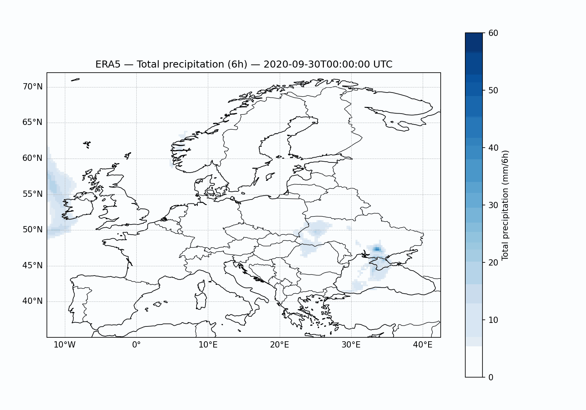

<h2 align="center">
  Explainability in a chaotic system – Application to weather forecasting
</h2>

<p align="center">
  
</p>


## 💡 Overview

This repository contains all the code developed as part of a CentraleSupélec project conducted in partnership with HeadMind Partners, focusing on the explainability of weather forecasting models. Specifically, we study precipitation prediction over Europe within a 6-hour forecasting horizon. Although some experiments were carried out with longer time horizons, their predictive performance was significantly lower; as a result, we chose not to include their explainability analyses in this repository. All models were trained using the ERA5 dataset from WeatherBench2.

The project is structured into two main phases:

1. **Precipitation prediction.**
We provide scripts to download and preprocess the data, train two types of models (U-Net and ConvLSTM), and evaluate their performance. More detailed information about the files and workflows is provided in a later section.

2. **Prediction explainability.**
We implement permutation-based methods and integrated gradients, combined with various aggregation strategies, to extract insights into the most influential input variables and time steps. These methods allow us to analyze which pixels contribute most to individual predictions, identify globally important features, explore patterns that are consistent with meteorological knowledge, and more. More detailed information about the explainability pipeline and related files is provided in a later section.


## 📦 Getting Started

To get a local copy of this project up and running, follow these steps.

1. **Clone the repository:**

   ```bash
   git clone git@github.com:manonarfib/X_Chaos_Meteo.git
   cd X_Chaos_Meteo
   ```

2. **Install dependencies:**

  We recommend using a virtual environment to manage dependencies.

   ```bash
   pip install -r requirements.txt
   ```

3. **Downloading UNet checkpoint**

If you can, you should install the Git LFS extension (see [https://git-lfs.com/](https://git-lfs.com/)), which handles the versioning of large files. In that case, you only need to run ```git lfs install``` (you only need to run that once in your git ), and the checkpoint is automatically usable from ```checkpoints/unet```.
However, if you can't install the extension (beware, it isn't installed on the DCE), you can clone the repository as usual, then go to [https://github.com/manonarfib/X_Chaos_Meteo/tree/main/checkpoints/unet](https://github.com/manonarfib/X_Chaos_Meteo/tree/main/checkpoints/unet), and manually download the checkpoint. Then you have to **rename** the file (we recommend to rename it ```best_mse_true.pt```), and drag and drop it in ```checkpoints/unet```.

## 📖 Usage

### 🗂️ Repository Structure Description

This repository is organized as follows:

```text
X_Chaos_Meteo/
├── checkpoints/
│   ├── convlstm/                       # Checkpoints for the ConvLSTM model according to the loss used during training
│   │   ├── advanced_torrential/
│   │   ├── mse/
│   │   └── ...
│   └── unet/                           # Checkpoint for the U-Net model corresponding to training with MSE loss
│   
├── demonstrator/
│   ├── app_avec_calendrier             # Main demonstrator file
│   ├── demo_demonstrator.webm          # Demonstration video
│   └── ...
│
├── download_dataset_from_gcs/          # Scripts to download the data from WeatherBench2
│
├── era5_visuals/
│   ├── figures/                        # Created visuals
│   └── visuels_era5.ipynb              # Notebook to create pretty representations of ERA5 variables
│
├── explainability/
│   ├── clusters/                       # Explain rain clusters instead of the whole map prediction
│   ├── explainable_by_design/          # WeatherCBM implementation
│   ├── features_permutation/           # Permutation-based importance methods
│   ├── integrated_gradients/           # Integrated Gradients implementation and aggregation methods
│   └── noise/                          # Noise methods for explainability
│
├── inference/
│   ├── compare_3models/                # Contains maps and boxplots for compare_model.py
│   ├── compare_predict_maps_outputs/   # Contains maps and boxplots for compare_predict_maps.py
│   ├── predict_maps_outputs/           # Contains maps and boxplots for predict_maps.py
│   ├── compare_model.py                # Create boxplot and map for an inference on test set sample for different models
│   ├── compare_predict_maps.py         # Create boxplots and maps for an inference on test set sample for different checkpoints using the same model architecture
│   └── predict_maps.py                 # Create boxplot and map for an inference on test set sample for one checkpoint 
│
├── models/
│   ├── ConvLSTM/                       # ConvLSTM architecture and training scripts
│   ├── unet/                           # U-Net architecture and training scripts
│   ├── mixture/                        # Mixing predictions of ConvLSTM and U-Net to improve final prediction
│   └── utils/                          # Preprocessing, postprocessing and evaluation scripts
│
├── spearman_correlations/              # Contains script to compute Spearman correlations between our features
│
├── requirements.txt                    # Python dependencies
├── README.md                           # Project documentation
├── LICENSE
└── .gitignore
```

### 🔍 Visualizing some variables

The notebook `era5_visuals/visuels_era5.ipynb` allows you to 


### 📚 Downloading the dataset

Downloading the dataset is not required to run the codes, as two weeks of data has been downloaded in this git for you (accessible in `./demonstrator/era5_europe_ml_test_2_weeks.zarr`). However if you wish to retrain the models or add new data, you must follow the format we used. 

In `./download_dataset_from_gcs/download_dataset.py`, change :  
- OUT_ZARR to the desired path,
- TIME_BLOCKS to download the period of time of your choice.

Run : 
   ```bash
   python -m download_dataset_from_gcs.download_dataset
   ```

### 🌧️ Training a weather forecasting model

Before training either model, make sure the ERA5 training and validation datasets are available locally and that the paths defined in the training scripts match your environment.

Typical expected files are:

```
era5_europe_ml_train.zarr
era5_europe_ml_validation.zarr
```
If your datasets are stored in a different location, update the corresponding configuration fields in the training scripts before launching training.

#### ConvLSTM

The ConvLSTM training pipeline is implemented in models/ConvLSTM/train_convlstm_with_downloaded_data.py, the script includes a configuration block where you can adjust:

- dataset paths: ```train_dataset_path``` and ```val_dataset_path```,
- sequence length: ```T``` with default value equals to ```8``` (inputs have a temporal window of ```t-42h``` to ```t```),
- prediction lead time: ```lead``` with default value equals to ```1``` (we predict precipitation in ```t+6h```), 
- batch size: ```batch_size``` we recommend to keep a low value since it could take a lot of place in memory,
- loss function: ```loss_type``` in ```str```,
- checkpoint and log locations: ```checkpoint_dir```.

Run training with:  
```
python -m models.ConvLSTM.train_convlstm_with_downloaded_data
```

Supported loss functions include: MSE, weighted MSE, Dice-based loss, and a custom advanced_torrential loss designed for heavy precipitation events.

Generated checkpoints and logs are saved under checkpoints/convlstm/, and a different subfolder is create according to the loss type you used for training. Make sure to change the checkpoint location if you changed other parameters (such as lead time or sequence length) or it could erase a previous checkpoint.

#### U-Net
The U-Net training pipeline is implemented in models/unet/training_optimized.py, the script includes a configuration block where you can adjust:

- dataset paths: ```dataset_train_path``` and ```dataset_val_path```,
- sequence length: ```n_input_steps``` with default value equals to ```8``` (inputs have a temporal window of ```t-42h``` to ```t```),
- prediction lead time: ```lead_steps``` with default value equals to ```1``` (we predict precipitation in ```t+6h```), 
- batch size: ```batch_size``` we recommend to keep a low value since it could take a lot of place in memory,
- loss function: ```loss_type``` in ```str```.

Run training with:  
```
python -m models.unet.training_optimized --save_path {SAVE_PATH}
```

Where ```SAVE_PATH``` is the path to which your checkpoints will be saved, we recommend you to put a path beginning with ```checkpoints/unet/```.  

Supported loss functions include: MSE, weighted MSE and a Dice-based losses.  

The pretrained checkpoint provided in this repository corresponds to the U-Net model trained with MSE loss.  

#### Additional remarks

- Training automatically uses a GPU when available.
- Checkpoint loading allows interrupted training to be resumed (a checkpoint is made after each validation but you have to redo the current epoch from the beginning).
- We recommend checking dataset paths and output directories before launching long experiments.
- Experiments take a very long time to finish, even with strong GPUs and a small number of epochs.


### 🔬 Explaining a pretrained model

#### Importance by feature permutation

We implement a permutation-based feature importance method to quantify the influence of each input variable and timestep on the model predictions.  
The idea is to measure how much the model performance degrades when a given feature is randomly permuted. More precisely:

1. A baseline prediction is computed on the original input.
2. For each feature (defined as a variable at a given timestep), we:
   - randomly shuffle its spatial values,
   - run the model again,
   - measure the increase in prediction error (MSE).
3. The importance of a feature is defined as the difference between the permuted error and the baseline error.

To compute permutation-based feature importance, one can run:

```
python -m explainability/features_permutation/permutation_importance
```

Make sure to configure:

- ```MODEL_TYPE``` ("unet" or "convlstm")
- ```CKPT_PATH``` (the checkpoint used for the model)
- ```DATASET_PATH```

inside the script before execution.


The script produces:

- A ```.npz``` file containing raw importance scores for each sample: ```explainability/features_permutation/permutation_importances_to_stack_time_and_var_<model>.npz```
- Aggregated visualizations:
  1. Importance per variable
      - Averaged over time and samples
      - Displayed as a bar plot (top-k variables)
  2. Importance per timestep
      - Averaged over variables and samples
      - Displayed as a line plot with uncertainty (mean ± std)  
      
    Saved in: ```explainability/features_permutation/figures/```

#### Integrated Gradients methods

We also provide an explainability pipeline based on Integrated Gradients (IG) to identify which input variables, timesteps, and spatial regions contribute the most to the model prediction.

Unlike permutation importance, which measures the performance drop caused by perturbing an input feature, Integrated Gradients is a gradient-based attribution method. It computes feature attributions by integrating gradients along a path between a baseline input and the actual sample. This makes it possible to obtain both:

- global importance summaries, aggregated over multiple samples of the test set,
- local explanations, showing which pixels and variables influenced a specific prediction.

Given an input sample and a baseline, Integrated Gradients computes the attribution of each input feature by accumulating gradients along interpolated inputs between the baseline and the original sample.

In this implementation, attributions are computed with respect to a target prediction region defined from the model output itself. More precisely:

1. The model predicts a precipitation map.
2. A region of interest is defined as the pixels above a chosen prediction quantile.
3. Integrated Gradients is computed with respect to the sum of predictions over this region.

This allows the method to focus on the input features that most influence the strongest predicted precipitation areas.  

The script is configured directly through a user-defined configuration block at the top of the file.

Main parameters that can be modified are:

- `MODEL_TYPE`: model to explain (`"convlstm"` or `"unet"`)
- `LOSS_NAME`: used for output folder naming
- `CKPT_PATH`: path to the model checkpoint
- `DATASET_PATH`: path to the dataset used for explainability
- `SAMPLE_IDX`: index of the sample used for local visualizations
- `T`: number of input timesteps
- `LEAD`: prediction lead time

Aggregation settings:

- `DO_AGG`: whether to compute global aggregated importance over multiple samples
- `N_SAMPLES_AGG`: number of samples used for aggregation
- `SEED`: random seed for reproducibility

Attribution settings:

- `IG_STEPS`: number of interpolation steps for Integrated Gradients
- `BASELINE_MODE`: baseline type (`"zeros"` or `"mean_over_space_time"`)
- `REGION_QUANTILE`: quantile used to define the region of interest in the predicted map

Visualization settings:

- `T_VIEW`: reference timestep used for map visualizations
- `CONTOUR_Q`: quantile used to draw the attribution contour overlay
- `TOP_K_VARS`: number of top variables to visualize

To run the explainability script, execute:

```
python -m explainability.integrated_gradients.integrated_gradients
```

Before running it, make sure that:

- the dataset path is correct,
- the checkpoint path matches the chosen model,
- the configuration block at the top of the script has been adapted to your experiment.


The script produces two types of outputs.

1. Aggregated importance over multiple samples  
  If `DO_AGG = True`, the script computes attributions for a random subset of the dataset and saves:  

    - variable importance plots
    - mean importance across samples
    - mean ± standard deviation across samples
    - time importance plots
    - mean importance across samples
    - mean ± standard deviation across samples  
    
    These plots provide a global view of which variables and timesteps are the most influential for the model.

2. Detailed visualizations for one selected sample  
For the sample specified by SAMPLE_IDX, the script saves:

    - a variable importance bar plot
    - a time importance line plot
    - a global attribution map aggregated over all variables and timesteps
    - detailed maps for the top-k most important variables  
    
    For each top variable, the visualization includes:

    - the precipitation input map,
    - the selected variable at several recent timesteps,
    - the attribution map for that variable,
    - a contour showing the most important attribution regions overlaid on the precipitation map  
    
    This makes it possible to inspect how the model uses specific atmospheric variables in space and time.

Generated files are saved under:
```explainability/integrated gradients/ig_outputs/ ```

with subfolders depending on:

 - the model (unet or convlstm),
 - the loss name,
 - the prediction lead time,
 - the selected sample index.

### Training WeatherCBM (explainable-by-design model) and interpreting it

#### Training 

The WeatherCBM training pipeline is implemented in explainability/explainable_by_design/training_WeatherCBM(_with_reg_on_vars).py. The file _with_reg_on_vars implements the version of WeatherCBM with additional loss terms further constraining the use of input variables by the concepts. In each case, the script includes a configuration block where you can adjust:

- dataset paths: ```train_dataset_path``` and ```val_dataset_path```,
- sequence length: ```T``` with default value equals to ```8``` (inputs have a temporal window of ```t-42h``` to ```t```),
- prediction lead time: ```lead``` with default value equals to ```1``` (we predict precipitation in ```t+6h```), 
- batch size: ```batch_size``` we recommend to keep a low value since it could take a lot of place in memory,
- loss function: ```loss_type``` in ```str```,
- checkpoint and log locations: ```checkpoint_dir```.

Run training with:  
```
python -m explainability.explainable_by_design.training_WeatherCBM_with_reg_on_vars
```

Generated checkpoints and logs are saved under checkpoints/weathercbm/, and a different subfolder is created according to the name you specify. Make sure to change the checkpoint location if you changed other parameters (such as lead time or sequence length) or it could erase a previous checkpoint.

#### Interpretation

explainability/explainable_by_design/explain_results contains files to interpret the model. 
- integrated_gradients allows you to visualize which input variables contribute the most to each concept
- predict_concept_activation saves maps corresponding to the activation of the concepts on a specific sample
- analysis_regularization gives you access to matrix A of the model with regularization on the input variables, that is to say the importance matrix of each input variable for each concept

### 🖥️ Demonstrator

A demonstrator was also developed, permitting the user to test most of the functionalities described above. It can be accessed here :

[](https://xchaosmeteo-demonstrator.streamlit.app/)

You can also download a short demonstration video if you struggle to use the demonstrator : [[Demonstration video]](https://github.com/manonarfib/X_Chaos_Meteo/raw/main/demonstrator/demo_demonstrator.webm)

## 🤝 Authors

This repository was created and equally contributed to by :
- Louisa Arfib : [https://github.com/arfiblouisa](https://github.com/arfiblouisa)
- Manon Arfib : [https://github.com/manonarfib](https://github.com/manonarfib)
- Nathan Morin : [https://github.com/Nathan9842](https://github.com/Nathan9842)

## ⭐ Acknowledgment

A huge thank you to Florestan Fontaine from HeadMind Partners for his help and valuable advice.

## 📄 License

This project is licensed under the Creative Commons Attribution-NonCommercial 4.0 International License (CC BY-NC 4.0).

You are permitted to use, share, and adapt the material for non-commercial purposes, provided that appropriate credit is given to the original authors.

Commercial use of this work is strictly prohibited without prior written permission from the authors.

For full license terms, see: https://creativecommons.org/licenses/by-nc/4.0/
